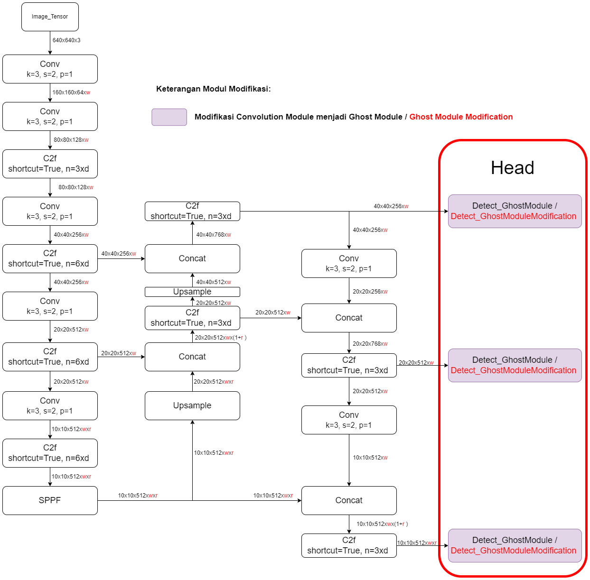
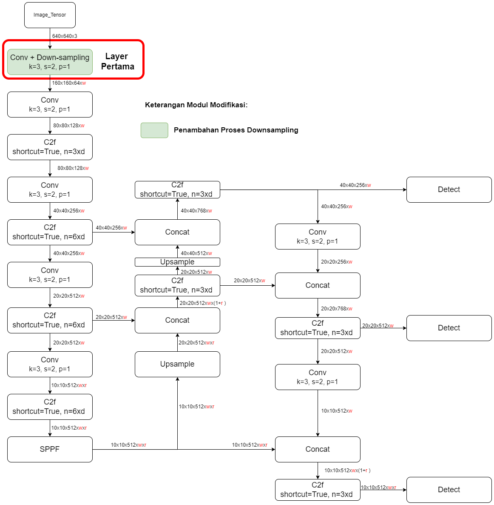
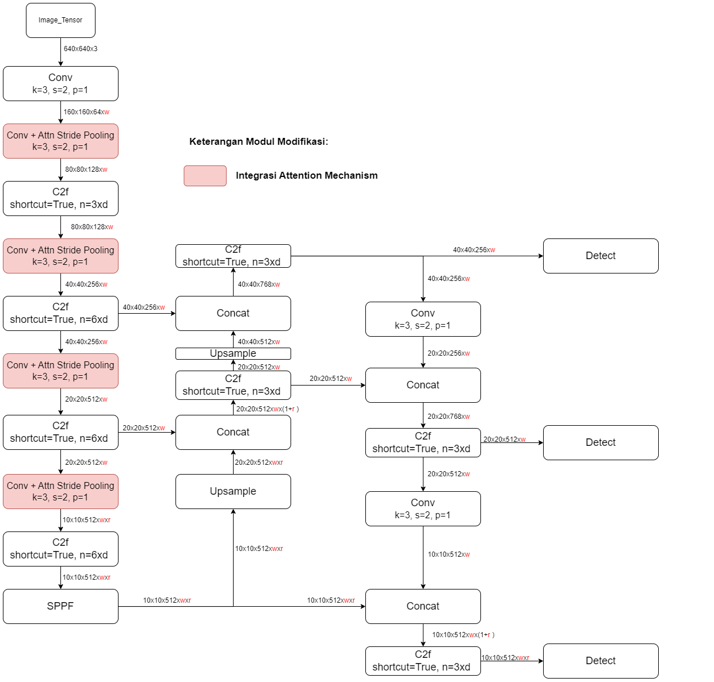

YOLOv8_MSG adalah YOLOv8 versi nano yang telah dioptimasi menggunakan metode:
- Implementasi <a href="https://arxiv.org/abs/1911.11907">Ghost Module</a>
  - Modifikasi Bagian Head (Detect):
    
    - Detect_GhostModule (ultralytics/nn/modules/head.py):
      - GhostConv (ultralytics/nn/modules/conv.py)
    - Detect_GhostModule_Modfication (ultralytics/nn/modules/head.py):
      - GhostConv_Modification (ultralytics/nn/modules/conv.py)
- Penambahan Proses Down-sampling
  - Modifikasi Conv Module:
    
    - Conv_Avg_Pooling (ultralytics/nn/modules/conv.py)
    - Conv_Max_Pooling (ultralytics/nn/modules/conv.py)
    - Conv_Max_Pooling_Dropout (ultralytics/nn/modules/conv.py)
    - Conv_Attn_Pooling (ultralytics/nn/modules/conv.py)
- Integrasi Attention Mechanism (<a href="https://arxiv.org/abs/1807.06521">CBAM</a>)
  
  - Conv_Stride_Attn_Pooling (ultralytics/nn/modules/conv.py)

## <div align="center">Dokumentasi</div>

## Contoh Penggunaan

<summary>Contoh Penggunaan</summary>

### Python

- Nama Model:
  - yolov8n_GhostModule.yaml (YOLOv8n + Ghost Module)(ultralytics/cfg/models/v8/yolov8n_GhostModule.yaml)
  - yolov8n_GhostModule_Avg_Pooling.yaml (YOLOv8n + Ghost Module + Down-sampling)(ultralytics/cfg/models/v8/yolov8n_GhostModule_Avg_Pooling.yaml)
  - yolov8n_GhostModule_Avg_Pooling_CBAM.yaml (YOLOv8n + Ghost Module + Down-sampling + Attention Mechanism)(ultralytics/cfg/models/v8/yolov8n_GhostModule_Avg_Pooling_CBAM.yaml)

```bash
pip install ultralytics
```

```bash
git clone https://github.com/MInsanKamil/YOLOv8_MSG.git
```

```bash
cd YOLOv8_MSG
```

```python
from ultralytics.models.yolo.model import YOLO

# Load a model
model = YOLO("ultralytics/cfg/models/v8/nama_model.yaml") # build a new model from scratch
model = YOLO("ultralytics/cfg/models/v8/nama_model.yaml").load("yolov8n.pt")  # load weight pretrained yolov8n coco dataset

# Load a model pretrained yolov8_msg indoor dataset
model = YOLO('best.pt')

# Use the model
model.train(data="coco8.yaml", epochs=3)  # train the model
metrics = model.val()  # evaluate model performance on the validation set
results = model("https://ultralytics.com/images/bus.jpg")  # predict on an image
path = model.export(format="onnx")  # export the model to ONNX format
```

### Notebooks

| Notebook                                                                                                                           | 
| <a href="https://colab.research.google.com/drive/1Lx3UP3TE2dDNbCZMLID4DaG7uIWnninW#scrollTo=75-VWNhGmS9q">Evaluasi Model</a>                                      | 

## <div align="center">Models</div>

Dibawah ini hasi  evaluasi model untuk mendeteksi objek dalam rumah ([Indoor Object Dataset](https://app.roboflow.com/csgitk/indoor_object_ta/10)) 

| Model                                                                                | size<br><sup>(pixels) | Dropout Probability | Kernel Size<br><sup>(Depthwise Convolution) | mAP<sup>val<br>50 | mAP<sup>test<br>50 | GFLOPs<br><sup>(B) | Notebook |
| ------------------------------------------------------------------------------------ | --------------------- | --------------------- | --------------------- | -------------------- | -------------------- | ----------------- | ----------------- |
| YOLOv8n (Baseline) | 640                   | -                 |-                 | 73.1                | 71.1                | 8.09               | <a href="https://colab.research.google.com/drive/1tauym8RFvROraSxZMoH_j-M75hEdTP06">Google Colab</a>               |
| YOLOv8n + Attention Stride Pooling | 640                   | -                 |-                 | 73.4                | 73.2                | 8.16               | <a href="https://colab.research.google.com/drive/1oAk-KiOx5T_AijxV6NgcGu4tStDfpQAA">Google Colab</a>               |
| YOLOv8n + Ghost Module | 640                   | -                 | 7                 | 72.5                | 72.9                | 6.75               | <a href="https://colab.research.google.com/drive/1wJi2BJaLfEeS3n8gyJvYDO9RvKevd-Mi">Google Colab</a>               |
| YOLOv8n + Ghost Module | 640                   | -                 | 5                 | 72.8                | 73.1               | 6.70               | <a href="https://colab.research.google.com/drive/1kxjcu7V3y2hNS8KonhTnh2vHAI5wdMHl">Google Colab</a>               |
| YOLOv8n + Ghost Module | 640                   | -                 | 3                 | 73                | 73.1               | 6.67               | <a href="https://colab.research.google.com/drive/1EGhnoWRs1DIboTLFZDcIlkRTNOldarbZ">Google Colab</a>               |
| YOLOv8n + Ghost Module Modification | 640                   | -                 | 3                 | 72.5                | 71.7               | 5.87               | <a href="https://colab.research.google.com/drive/1LMX5u7YOOFOJ2ftsuN0nog6jkRqQzKzq">Google Colab</a>               |
| YOLOv8n + Attention Max Pooling | 640                   | -                 | -                 | 74.4                | 72.1               | 2.13               | <a href="https://colab.research.google.com/drive/1AC01NK_gEP6ewrIGVYfTsV7S3pXJQtup">Google Colab</a>               |
| YOLOv8n + Average Pooling | 640                   | -                 | -                 | 74.8                | 72.5               | 2.10               | <a href="https://colab.research.google.com/drive/19-die4pmkryyYEU48PKGZkxtPvUQwoS7">Google Colab</a>               |
| YOLOv8n + Max Pooling | 640                   | -                 | -                 | 74.3                | 71.9               | 2.10               | <a href="https://colab.research.google.com/drive/1AtbJaTVoDid_CUBf-sGnKDOqNdjizQHG">Google Colab</a>               |
| YOLOv8n + Max Pooling Dropout | 640                   | 0.01                 | -                 | 74.7                | 72.8               | 2.10               | <a href="https://colab.research.google.com/drive/1iByjZJ72ei2UTwPkbPUUjKoJQ22qWiC3">Google Colab</a>               |
| YOLOv8n + Max Pooling Dropout | 640                   | 0.02                 | -                 | 73.2                | 72.3               | 2.10               | <a href="https://colab.research.google.com/drive/1uP69Lu8Q2tdcm-mOxLM4mc2a1nRaGGYh">Google Colab</a>               |
| YOLOv8n + Max Pooling Dropout | 640                   | 0.03                 | -                 | 73.6                | 71.1               | 2.10               | <a href="https://colab.research.google.com/drive/1d321k2eNWhM2bQJfUqe9TAeG6VJa68jx">Google Colab</a>               |
| YOLOv8n + Max Pooling Dropout | 640                   | 0.04                 | -                 | 73.6                | 73.3               | 2.10               | <a href="https://colab.research.google.com/drive/1IzkrnnqlH6YtdLLBrbQ9fWeTvRUFNUXj">Google Colab</a>               |
| YOLOv8n + Max Pooling Dropout | 640                   | 0.05                 | -                 | 73.8                | 72.2               | 2.10               | <a href="https://colab.research.google.com/drive/1v82tdJhy_3HOIIuE_OP5zEy5NVpU7TRX">Google Colab</a>               |
| YOLOv8n + Max Pooling Dropout | 640                   | 0.06                 | -                 | 73.4                | 73.8               | 2.10               | <a href="https://colab.research.google.com/drive/1wyQwIqQUqsyrhq-J1ChZMzHZdXzp7OxH">Google Colab</a>               |
| YOLOv8n + Max Pooling Dropout | 640                   | 0.07                 | -                 | 73.8                | 72.4               | 2.10               | <a href="https://colab.research.google.com/drive/1WDl5uWZtz3lHkbhA3Z76R_wcc6uNWY57">Google Colab</a>               |
| YOLOv8n + Max Pooling Dropout | 640                   | 0.08                 | -                 | 73.9                | 71.6               | 2.10               | <a href="https://colab.research.google.com/drive/14IFkHh-r6bEhuwfzEHsITMPMlHzqwHw1">Google Colab</a>               |
| YOLOv8n + Max Pooling Dropout | 640                   | 0.09                 | -                 | 73                | 72.4               | 2.10               | <a href="https://colab.research.google.com/drive/1iljS06oPhv_zzOz6pFBOOzhPDFV11mIa">Google Colab</a>               |
| YOLOv8n + Max Pooling Dropout | 640                   | 0.1                 | -                 | 73.4                | 70.9               | 2.10               | <a href="https://colab.research.google.com/drive/1rpY6zMafH-yW1r7IayUUjsA580j6Env-">Google Colab</a>               |
| YOLOv8n + Max Pooling Dropout | 640                   | 0.2                 | -                 | 73.5                | 71.5               | 2.10               | <a href="https://colab.research.google.com/drive/1tG5bO141rsPMgpZa9IifaoBKzJMqnr7o">Google Colab</a>               |
| YOLOv8n + Max Pooling Dropout | 640                   | 0.3                 | -                 | 72.4                | 71.7               | 2.10               | <a href="https://colab.research.google.com/drive/1IRSOeSq9OchVr_S85TWDtD6Ven3QEbfR">Google Colab</a>               |
| YOLOv8n + Max Pooling Dropout | 640                   | 0.4                 | -                 | 72.8                | 69.7               | 2.10               | <a href="https://colab.research.google.com/drive/1F_7ZJiSaWOxysgtYURzL0S-RgC7SB75M">Google Colab</a>               |
| YOLOv8n + Max Pooling Dropout | 640                   | 0.5                 | -                 | 69.4                | 66.9               | 2.10               | <a href="https://colab.research.google.com/drive/1kct1MybGT0ST2S_z_JHOIFzplZKZgFcL">Google Colab</a>               |
| YOLOv8n + Ghost Module + Average Pooling | 640                   | -                 | 3                 | 71.7                | 73.4               | 1.75               | <a href="https://colab.research.google.com/drive/1sSuooIUjtvTy0F-QVRW-NIX6p7eZwNFP">Google Colab</a>               |
| YOLOv8n + Ghost Module + Max Pooling Dropout| 640                   | 0.06                 | 3                 | 72.8                | 71.4               | 1.75               | <a href="https://colab.research.google.com/drive/1ABkXT8agaNI2aIzYWenWdZerV-Us-lgV">Google Colab</a>               |
| YOLOv8n + Ghost Module + Max Pooling | 640                   | -                 | 3                 | 73.6                | 71.9               | 1.75               | <a href="https://colab.research.google.com/drive/16TrqxfN4a4_kAOdt7iGJjTZYeLKJSHFb">Google Colab</a>               |
| YOLOv8n + Ghost Module + Attention Max Pooling | 640                   | -                 | 3                 | 73.3                | 73.2               | 1.77               | <a href="https://colab.research.google.com/drive/1SLKbdcuPR9mJYlht0utINjLx5umYdVhf">Google Colab</a>               |
| YOLOv8n + Ghost Module + Attention Max Pooling + Attention Stride Pooling| 640                   | -                 | 3                 | 74.1                | 73.4               | 1.79               | <a href="https://colab.research.google.com/drive/157hl1vddPlStaCiTto6cn5AIoAetjIw9">Google Colab</a>               |
